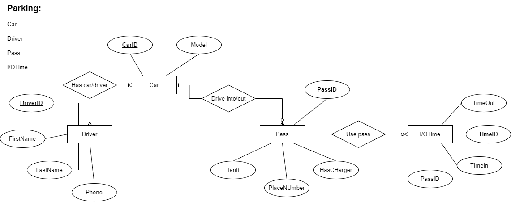

# Parking 

Галузь розбита на 4 сутності: водій, машина, пропуск і час.
- Driver – сутність з описом водія, містить його ім’я, фамілію, унікальний ідентифікатор (номер прав) і контактний телефон. Ця сутність дозволяє ідентифікувати власників авто.
- Car – сутність з описом авто, містить назву моделі і унікальний ідентифікатор авто. 
- Pass – сутність пропуска, містить його унікальний номер, ідентифікатор авто, до якого прив’язаний пропуск, номер місця на якому стане машина, інформацію про саме місце (наявність зарядки для електрокарів і тариф для цього місця). Ця сутність зв’язує авто з місцем на якому стоїть це авто. 
- I/OTime – досить абстрактна сутність, призначена для нормалізації бази даних, це дозволяє не створювати нові записи при в’їзді/виїзді авто до/з паркінгу до таблиці сутності Pass. Ця сутність зберігає інформацію про час і ідентифікатор пропуску, до якого відносяться записи про час. 

Звіт у [Google Docs](https://docs.google.com/document/d/10j8XDW4pWMZjxgts1cYEMhI-oa5pJ73TAf35gIoUJTk/edit?usp=sharing)

##Варіант:
	Види індексів - GIN, BRIN
	Умови для тригера - after insert, update